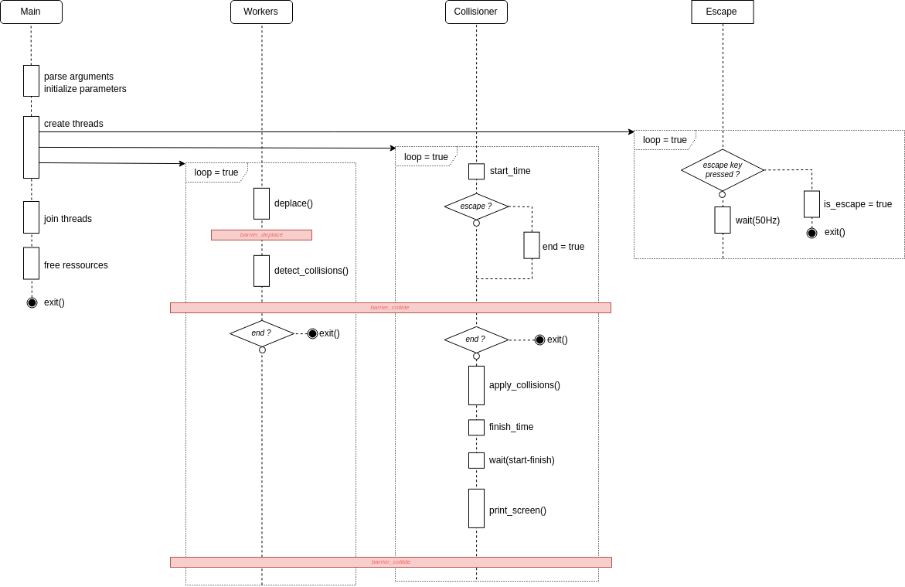

# Agario

**Résalisé par**: Lucas Pallud, Justin Foltz

**Date:** 05-2019

## Le projet

Ce travaile consiste en un simulateur simplifié du jeu original Agario. Les cellules sont contrôlées par ordinateur et l’affichage, la gestion du clavier et la logique du jeu sont gérées de manière concurrente.

### Règles du simulateur

- Le domaine de jeu est rectangulaire et défini par une largeur et une hauteur fixes.
- Sur ce domaine, sont présentes des particules de nourriture qui sont caractérisées uniquement par leur position (taille = 1). Si une cellule rencontre une particule de nourriture, la cellule gagne en masse et la particule disparait du domaine. La quantité de nourriture initiale est définie au début du programme. Lorsqu’une particule est mangée et selon une probabilité donnée, la nourriture “réapparaît” sur des points aléatoires du domaine qui ne contiennent pas déjà une particule.
- Chaque cellule est définie par un état (“morte” ou “vivante”), une couleur (fixe tout au long de la vie de la cellule), une direction de déplacement, une position sur le domaine de jeu et une masse (initialement comprise entre 5 et 8). De cette masse, sont déduits le rayon du disque la représentant graphiquement et sa vitesse de déplacement. Elle se déplace de manière aléatoire dans une direction donnée, selon les huit points cardinaux principaux, et change de direction après un certain temps, de manière aléatoire également. Si son centre entre en collision avec les bords du domaine de jeu, elle doit rebondir (voir explications plus bas). Si elle mange une particule de nourriture, elle gagne une unité de masse, mais perds en vitesse. Elle ne peut augmenter que d’une unité à la fois, c’est à dire manger une seule particule de nourriture à chaque déplacement. Si elle mange une autre cellule, elle récupère la masse de cette dernière. Si elle est mangée par une autre cellule, son état passe à “mort” et au bout d’un certain temps, elle réapparaît sur le domaine, de manière analogue aux conditions initiales. La hauteur du domaine de jeu représentera également la masse maximale d’une cellule.

## Lancement du projet

### Prerequis :

Le paquet **[libsdl2-dev](apt://libsdl2-dev)** doit être présent

### Compilation :

```makefile
make
```

### Lancement :

```bash
./agario <width> <height> <seed> <food> <dir> <res> <nf> <freq> <workers> <cells>
```

- La taille du domaine à créer est donnée par les arguments **width** et **height** spécifiés sur la ligne de commande, entiers plus grands ou égaux à 100.
- L’état initial du domaine (absence/présence de particules de nourriture) est calculé aléatoirement selon les deux arguments **seed** et **food** spécifiés sur la ligne de commande :
  - **seed** (entier) est la graine à utiliser par le générateur de nombres aléatoires.
  - **food** (valeur décimale dans le range [0..1[) représente la proportion de cases du domaine occupées par des particules de nourriture. Par exemple, 0.1 représente une surface occupée de 10% par de la nourriture.
  - Les arguments **dir**, **res** et **nf** (valeurs décimales dans le range [0..1[) représentent les probabilités de :
    - **dir** : changement de direction d’une cellule (vivante).
    - **res** : pour une cellule morte, réapparaître (testé à chaque frame).
    - **nf** (pour “new food”): faire apparaître une nouvelle particule de nourriture sur une position qui ne comprend pas déjà de nourriture.
  - **freq** est un entier (> 0), représentant la fréquence d’affichage en Hz.
  - **workers** est un entier (>= 1) donnant le nombre de threads travailleurs.
  - **cells** est un entier (>= 1 et >= workers) représentant le nombre de cellules.

 Exemple :

```bash
./agario 960 600 0 0.001 0.01 0.05 0.1 30 4 10
```

## Diagramme d'activité



