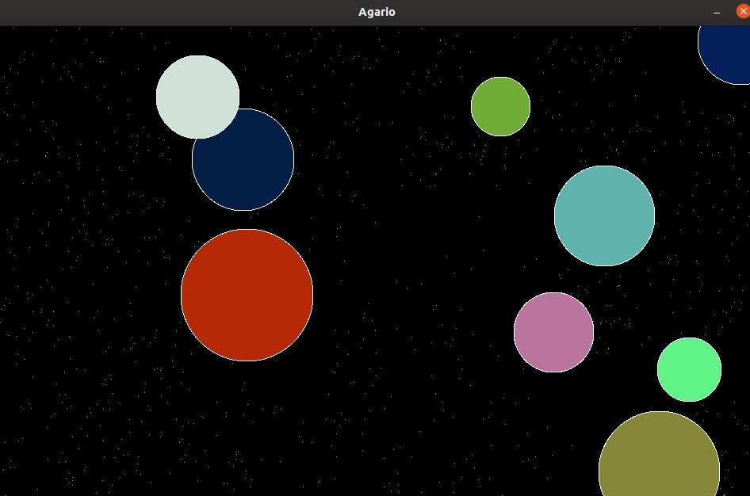

# Agario

**Developed by**: Justin Foltz, Lucas Pallud

**Date:** 05.2019

## The project

This work consists of a simplified simulator of the original Agario game. The cells are controlled by computer and the display, keyboard management and game logic are managed concurrently.



### Rules of simulator

- The domain is rectangular and defined by a fixed width and height.
- In this area, food particles are present which are characterized only by their position (size = 1). If a cell encounters a food particle, the cell gains mass and the particle disappears from the domain. The initial amount of food is defined at the beginning of the program.When a particle is eaten (with a given probability), the food "reappears" at random points in the domain that do not already contain a particle.
- Each cell is defined by a state ("dead" or "alive"), a color (fixed throughout the life of the cell), a direction of movement, a position on the playing field and a mass (initially between 5 and 8). From this mass, are deduced the radius of the disk representing it graphically and its speed of movement. It moves randomly in a given direction, according to the eight main cardinal points, and changes direction after a certain time, also randomly. If its center collides with the edges of the playing area, it must bounce. If it eats a particle of food, it gains one unit of mass, but loses speed. It can only increase by one unit at a time, i.e. it can only eat one food particle at a time. If it eats another cell, it recovers its mass. If it is eaten by another cell, its state passes to "death" and after a certain time, it reappears on the domain, in a similar way to the initial conditions. The height of the domain will also represent the maximum mass of a cell.

## Technologies

The project is entirely developed in c.

## How to run the project ?

### Prerequisites

Package **[libsdl2-dev](apt://libsdl2-dev)** must be installed.

### Running the project

1. Clone the repository

2. Compile the project :

   ```bash
   make
   ```

3. Run the simulation: 

   ```bash
   ./agario <width> <height> <seed> <food> <dir> <res> <nf> <freq> <workers> <cells>
   ```

   - The size of the domain to be created is given by the arguments **width** and **height** specified on the command line, integers greater than or equal to 100.

   - The initial state of the domain (absence/presence of food particles) is calculated randomly according to the two arguments **seed** and **food** specified on the command line :

     - **seed** (integer) is the seed to be used by the random number generator.
     - **food** (decimal value in the range [0..1[) represents the proportion of cells in the domain occupied by food particles. For example, 0.1 represents an area of 10% occupied by food.
     - The arguments **dir**, **res** and **nf** (decimal values in range [0..1[) represent the probabilities of :
       - **dir** : change of direction of a (living) cell.
       - **res** : for a dead cell, reappear (tested at each frame).
       - **nf** (for "new food"): to make a new food particle appear on a position that does not already contain food.
     - **freq** is an integer (> 0), representing the display frequency in Hz.
     - **workers** is an integer (>= 1) giving the number of threads working.

   - Example :

     ```bash
     ./agario 960 600 0 0.001 0.01 0.05 0.1 30 4 10
     ```

### Stopping the simulation

Simulation can be stopped by pressing `esc` key.

### Cleaning the project

To clean the files generated during the compilation, use the following command :

```bash
make clean
```

